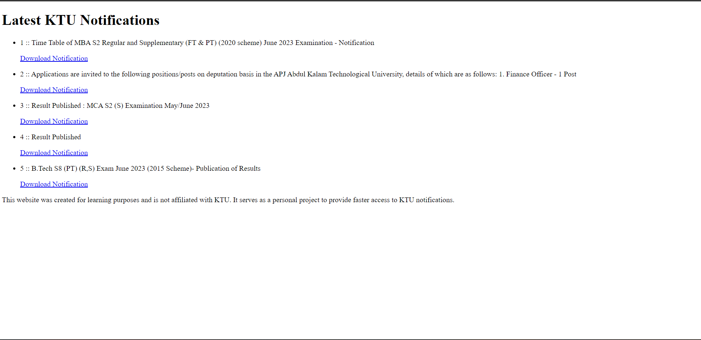

# KTU FlashAlert

KTU FlashAlert is a lightweight web application designed to provide speedy notifications from the APJ Abdul Kalam Technological University (KTU). Stay up-to-date with the latest announcements, exam schedules, and important updates directly from KTU. Get instant access to essential information without the hassle.

## Features

- Instantly receive notifications and updates from KTU.
- Effortlessly access important announcements and exam schedules.
- User-friendly interface for a seamless experience.
- Swift and efficient delivery of information.

